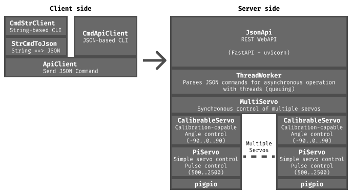

# pi0servo

`pi0servo` は、
Raspberry Piでサーボモーターを制御するためのPythonライブラリです。

`pigpio`ライブラリを基盤として、
Raspberry Pi Zero 2W のような非力な機種で、
安価なサーボモーター(SG90など)を
複数、同期させて動かすことができます。

サーボモーターごとの個体差を吸収するためのキャリブレーション機能もあります。

## 特徴

- **追加ハードウェア不要**:

  `pigpio`を利用するため、PCA9685のような追加のドライバー回路なしで、
  Raspberry PiのGPIOから直接サーボを制御できます。

- **柔軟なピン割り当て**:
  
  ほぼ全てのGPIOピンをサーボモーターの制御に使用できます。

- **高性能**: 

  Raspberry Pi Zero 2W のような性能の低いデバイスでも、
  多数のサーボを滑らかに同期させて動かせます。
  
- **キャリブレーション機能**:

  サーボモーターの個体差を吸収するため、
  -90度、0度、+90度の位置を補正し、
  設定をファイルに保存できます。

- **複数サーボの同期制御**:

  複数のサーボを個別の角度に、かつ同時に、動かすことができます。
  ロボットなどの開発に最適です。

- **リモート制御**:

  REST APIで、リモートから制御することができます。
  コマンドはJSONと、文字列コマンドがあり、
  手軽に複雑な制御が可能です。

- **多彩な制御方法**:

  上記、同期制御、リモート制御以外にも、
  同期制御やリモート制御が不要な場合は、
  より、単純かつ手軽なAPIも利用可能です。
  
- **CLI(コマンドライン)制御も可能**

  ライブラリとしての利用だけでなく、
  コマンドラインからの直接操作、
  ネットワーク越しの操作も可能です。


## == 動作環境

- **対応機種**: Raspberry Pi Zero 2W..4B (pigpioが動作する機種)
- **非対応機種**: Raspberry Pi 5, Pico


## == インストール

### === `pigpio`のインストールと設定

本ライブラリは`pigpio`デーモンが動作している必要があります。
詳しくは、下記のドキュメントを参照してください。

- [pigpiodのインストール・設定・自動起動設定](docs/setup-pigpiod.md)


### === 本ライブラリ(`pi0servo`)のインストール

作業用ディレクトリと、venv環境のアクティベート

``` bash
# 作業ディレクトリの作成
mkdir work
cd work

# venv環境の作成とアクティベート
python -m venv .env
source ./.env/bin/activate

# pipコマンドのアップデート
pip install -U pip

# 依存するライブラリのインストール
pip install -U fastapi uvicorn

# pi0servoのインストール
pip install -U \
--index-url https://test.pypi.org/simple/ \
--extra-index-url https://pypi.org/simple \
pi0servo
```

**(注)** このパッケージは現在**TestPyPI**(テスト用公開サイト)で公開されています。
将来、本番用**PyPI**に公開した際は、**`pip install -U pi0servo`** で、依存するライブラリも含めてインストールすることができるようなる予定です。


## == ライブラリとしての利用

T.B.D.


## == 3. コマンドラインツールを使った使い方(例)

`pi0servo`ライブラリをインストールすると、
コマンドとしても実行でるようになります。

複数のサブコマンドがあり、
キャリブレーションやAPIのサーバー/クライアントを実行することができます。

各サブコマンドに、'-h'をつけると、
そのサブコマンドのコマンドラインに関するヘルプが表示されます。

``` bash
pi0servo サブコマンド名 -h
```

> | **サブコマンド名** |    **機能**               |
> | :---                | :---                      |
> | calib               | calibration tool          |
> | api-server          | JSON API Server           |
> | api-client          | API Client (JSON)         |
> | str-client          | String Command API Client |
> | servo               | servo command             |


### 3.1. キャリブレーション方法

以下のコマンドで、サーボモーターを一つずつ対話的にキャリブレーションすることができます。


**コマンド起動方法**

```bash
uv run pi0servo calib 17
```

起動後「h」でヘルプが表示されます。

```text
GPIO17: 0 deg: pulse=1500> === Usage ===

* Select target (Cyclic):

 -90 deg ------[TAB]-----> 0 deg ------[TAB]-----> 90 deg
 -90 deg <-[Shift]+[TAB]-- 0 deg <-[Shift]+[TAB]-- 90 deg

* Move: (Upper case is for fine tuning)

        [w], [Up] ,[k]
              ^
              v
        [s],[Down],[j]

* Save: [ENTER],[SPACE] : save current pulse

* Misc: [q], [Q] : Quit
        [h], [?] : Show this help

* conf_file: /home/ytani/servo.json

* GPIO17
   -90 deg: pulse =  620
     0 deg: pulse = 1500
    90 deg: pulse = 2500

GPIO17: 0 deg: pulse=1500>
```


### 3.2 APIサーバーの起動

```bash
# サブコマンド一覧表示
uv run pi0servo api-server 17 27 22 25
```


### 3.3 APIクライアントCLI (JSON版)

対話的で JSON形式のコマンドをAPIサーバーに送信するCLI。

JSONコマンドの詳細については、以下を参照してください。

- [JSONCMD_SAMPLES.md](docs/JSONCMD_SAMPLES.md) 

```bash
uv run pi0servo api-client
```


### 3.4 String Command API Client CLI

対話形式で、簡略化された独自の文字列コマンドを入力すると、内部でJSONに変換しサーバーに送信します。

文字列コマンドについては、以下を参照してください。

- [STR_CMD.md](docs/STR_CMD.md)

```bash
# ローカルでデフォルト設定の場合
uv run pi0servo

# モーターの回転方向を指定する場合
uv run pi0servo --angle_factor -1,-1,1,1

# リモート接続の例
uv run pi0servo --angle_factor -1,-1,1,1 --url http://192.168.x.x:8000/cmd
``` 

## 


