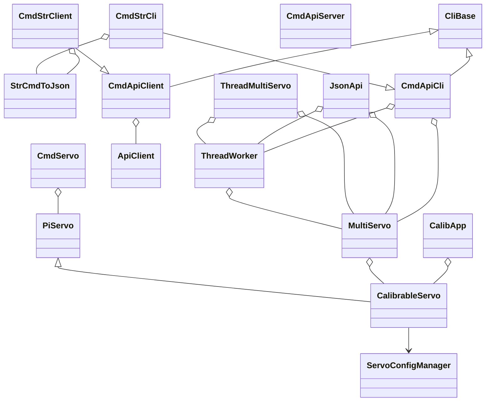
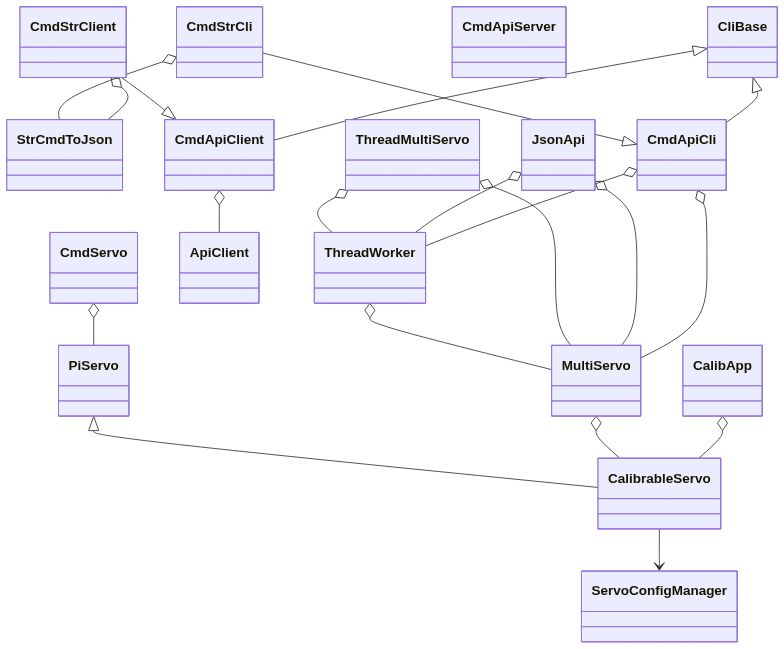

# クラス関係図

この図は、`pi0servo` プロジェクトの主要なクラスとその関係性を示しています。

## Mermaid.jsによるクラス図

## 関係性の説明

*   **継承 (`<|--`)**: `CalibrableServo` は `PiServo` を継承し、`CmdStrCli` は `CmdApiCli` を、`CmdStrClient` は `CmdApiClient` をそれぞれ継承しています。また、`CmdApiCli` と `CmdApiClient` は、外部ライブラリの `CliBase` を継承しています。
*   **コンポジション (`o--`)**: `MultiServo` は `CalibrableServo` のインスタンスを複数保持します。同様に、`ThreadMultiServo` は `MultiServo` と `ThreadWorker` のインスタンスを、`JsonApi` は `MultiServo` と `ThreadWorker` のインスタンスをそれぞれ保持します。
*   **関連 (`-->`)**: `CalibrableServo` は `ServoConfigManager` を利用して設定を永続化します。
*   **関連 (矢印なし)**: `ThreadWorker` は `MultiServo` を、`CmdServo` は `PiServo` を、`CalibApp` は `CalibrableServo` を、`CmdApiCli` は `MultiServo` と `ThreadWorker` を、`CmdApiClient` は `ApiClient` を、`CmdStrCli` は `StrCmdToJson` を、`CmdStrClient` は `StrCmdToJson` をそれぞれ利用します。

## クラスの詳細

### `PiServo`
`pigpio` を使用して単一のサーボを制御するための最も基本的なクラス。パルス幅の設定とサーボのオン・オフを管理します。

### `CalibrableServo`
`PiServo` を拡張し、キャリブレーション機能を追加したクラス。最小、最大、中央のパルス幅を定義し、角度とパルス幅の相互変換を行います。キャリブレーションデータは `ServoConfigManager` を通じて永続化されます。

### `MultiServo`
`CalibrableServo` のインスタンスを複数管理するクラス。複数のサーボを同時に制御するためのメソッド（同期移動など）を提供します。

### `ServoConfigManager`
サーボのキャリブレーションデータをJSONファイルに読み書きするためのクラス。設定ファイルは、カレントディレクトリ、ホームディレクトリ、`/etc/` の順で検索されます。

### `StrCmdToJson`
"mv:40,30" のような人間が読みやすい文字列コマンドを、`ThreadWorker` が解釈できるJSON形式のコマンドに変換するクラス。

### `ThreadWorker`
コマンドをキューで受け取り、別スレッドで順次実行する汎用的なクラス。これにより、サーボの制御を非同期で行うことができます。

### `ThreadMultiServo`
`MultiServo` と `ThreadWorker` をラップし、複数のサーボを非同期で制御するための高レベルなインターフェース。

### `JsonApi`
FastAPIを使用して、サーボを制御するためのJSON APIを実装するクラス。`/cmd` エンドポイントでコマンドを受け付け、`ThreadWorker` を介してサーボを制御します。

### `ApiClient`
`requests` ライブラリを使用して、Web APIにJSONコマンドをPOSTするためのクラス。

### `CmdServo`
`PiServo` を使用して、単一のサーボを直接制御するための基本的なCLIコマンドを実装するクラス。

### `CalibApp`
`blessed` ライブラリを使用して、サーボを対話的にキャリブレーションするためのCUIアプリケーション。

### `CmdApiCli`
JSON形式のコマンドをローカルの `ThreadWorker` に送信し、`MultiServo` を直接制御するためのCLI。

### `CmdApiClient`
リモートのAPIサーバーと通信するためのCLIクライアント。`ApiClient` を使用してHTTP経由でJSONコマンドを送信します。

### `CmdStrCli`
`CmdApiCli` を拡張し、人間が読みやすい文字列ベースのコマンドを受け付け、ローカルの `ThreadWorker` に送信するCLI。

### `CmdStrClient`
`CmdApiClient` を拡張し、人間が読みやすい文字列ベースのコマンドを受け付け、リモートのAPIサーバーに送信するCLI。

### `CmdApiServer`
`uvicorn` を使用して、FastAPIで実装されたJSON APIサーバーを起動するクラス。

### `CliBase`
外部ライブラリ `pyclibase` の基底クラス。CLIアプリケーションの共通機能を提供します。

## クラス図

